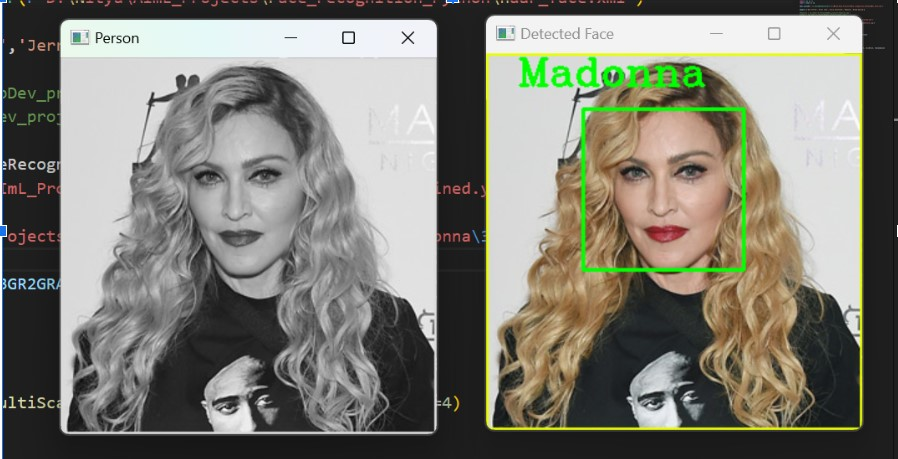
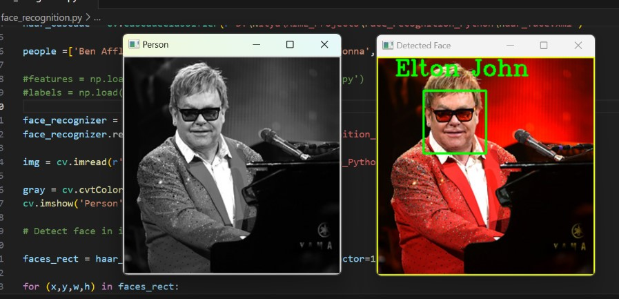
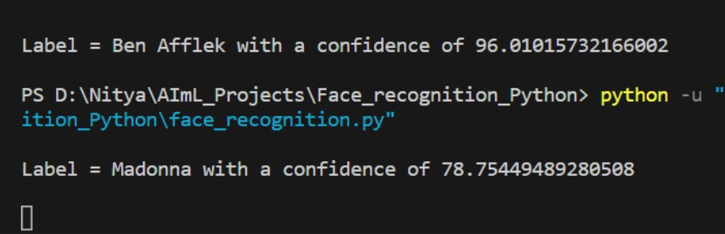

# Face Recognition using OpenCV 

This is a basic project of OpenCV image processing which uses **haar.cascade and LBPH FaceRecognizer Algorithm** in order to detect as well as recognize faces. 

To train the inbuilt libraries in order to recognize the 5 celebrities we have provided a data set of **100 images (20 each)**. After assigning each celebrity their features and labels through the *face_trained.py* and training and detecting them, the model was tested with a new set of images. 

The model showed results in 2 ways. First one being, detecting and highlighting the area of interest in the image (the facial features) and labeling the name above. Some examples can be seen below: 

---

---

The second one was giving an output to the terminal by stating the name of celebrity along with the confidence with which this image was shown. The sample output of this can be seen below: 

---

---